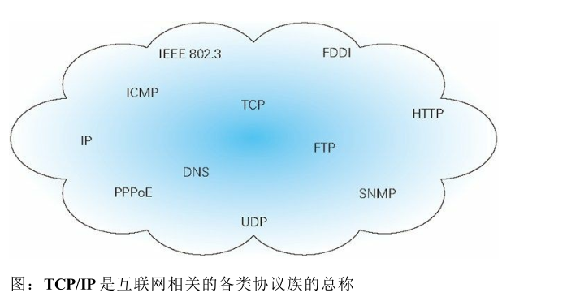
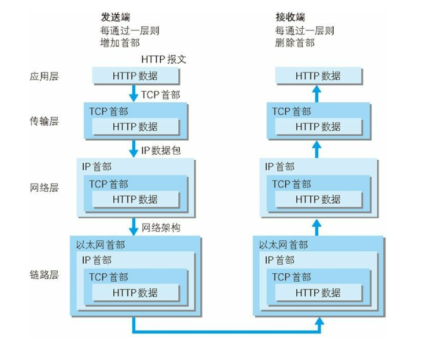

网络总体知识
===

**TCP/IP协议族**

通常使用的网络（包括互联网）是在 TCP/IP 协议族的基础上运作的。而 HTTP 属于它内部的一个子集

**TCP/IP 的分层管理**

TCP/IP 协议族按层次分别分为以下 4 层：`应用层、传输层、网络层和数据链路层`TCP/IP 协议族
各层的作用如下

**应用层**

TCP/IP 协议族内预存了各类通用的应用服务。比如，FTP（File
Transfer Protocol，文件传输协议）和 DNS（Domain Name System，域
名系统）服务就是其中两类、`注意，HTTP 协议也处于该层`

**传输层**

网上了解到传输层主要用于机器内硬件之间的信息传递

**网络层**

网上了解到网络层主要用于互联网上两台机器之间的数据传递

**链路层（又名数据链路层，网络接口层）**

用来处理连接网络的硬件部分。包括控制操作系统、硬件的设备驱
动、NIC（Network Interface Card，网络适配器，即网卡），及光纤等
物理可见部分（还包括连接器等一切传输媒介）。硬件上的范畴均在
链路层的作用范围之内。

**各层的协作图**

> 总结：通过以上学习知道，tcp/ip是一个协议族，http是这个协议族中的一个，http位于应用层（应用层
的作用是确定这个报文的类型，比如ftp、dns等），另外tcp/ip协议族可以分为4层，每层的作用独立。