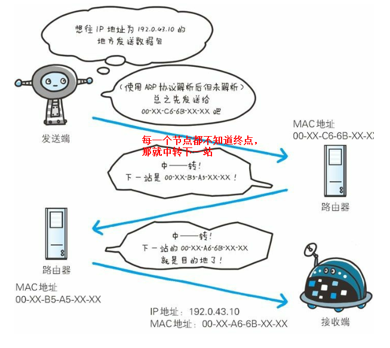
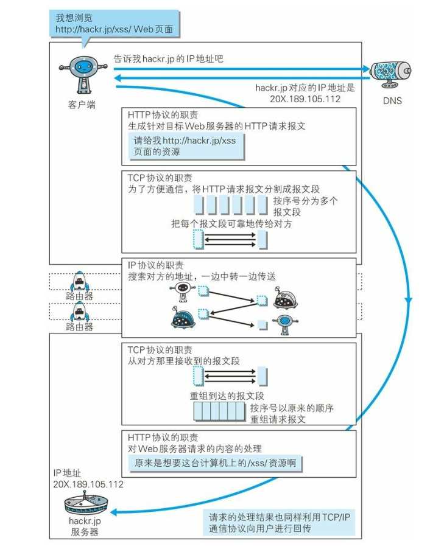

与http相关的IP、TCP、NDS协议
===

**负责传输的 IP 协议**

IP（Internet Protocol）网际协议位于网络层，TCP/IP 协议族中的 IP 指
的就是网际协议，协议名称中占据了一半位置，其重要性可见一斑。IP 协议的
作用是把各种数据包传送给对方。而要保证确实传送到对方那里，则需要满足各
类条件。其中两个重要的条件是 IP 地址和 MAC地址。IP 间的通信依赖 MAC 地址。
网络计算机之间的通讯会利用下一站中转设备的MAC地址来搜索下一个中转目标。
这时，会采用 ARP 协议。ARP 是一种用以解析地址的协议，根据通信方的 IP 地址
就可以反查出对应的 MAC 地址。

没有人能够全面掌握互联网中的传输状况
在到达通信目标前的中转过程中，那些计算机和路由器等网络设备只能获悉很粗略的传输路线。

**确保可靠性的 TCP 协议**

TCP 位于传输层,提供可靠的字节流服务.所谓的字节流服务（Byte Stream Service）是指，
为了方便传输，将大块数据分割成以报文段（segment）为单位的数据包进行管理。而可靠的
传输服务是指，能够把数据准确可靠地传给对方。

为了准确无误地将数据送达目标处，TCP 协议采用了三次握手（three-way handshaking）策略。
握手过程中使用了 TCP 的标志 —— SYN（synchronize 同步） 和ACK（acknowledgement 确认）。

**负责域名解析的 DNS 服务**

DNS（Domain Name System）服务是和 HTTP 协议一样位于应用层的协议。它提供域名到 IP 地址
之间的解析服务。DNS 协议提供通过域名查找 IP 地址，或逆向从 IP 地址反查域名的服务。

> 总结：各种协议与http协议的关系

